# DO5_SimpleDocker
## Part 1. Готовый докер

- Для начала необходимо взять официальный докер-образ с nginx и выкачать его при помощи `docker pull`.

    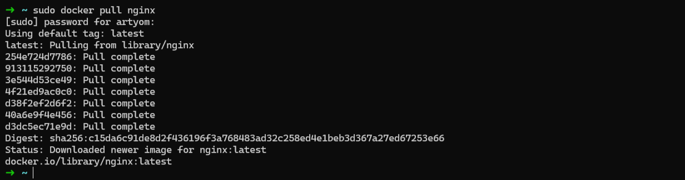

- Затем проверить наличие докер-образа через `docker images`.

    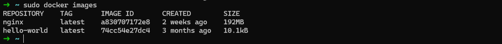

- Запуск докер-образа осуществляется командой `docker run -d nginx`.

    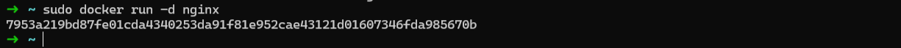

- Для проверки запуска образа используется команда `docker ps`.

    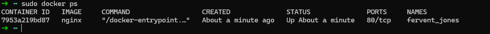

- Просмотр информации о контейнере осуществляется при помощи команды `docker inspect [container_id]`, где вместо `container_id` будет вставлен номер запущенного образа.

    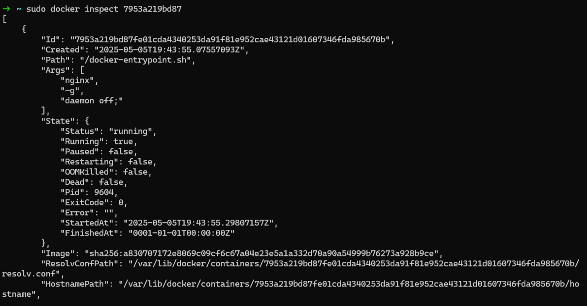

    Исходя из этих данных можно просмотреть:
    - размер контейнера: `67108864`

        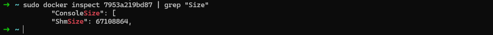

    - список замапленных портов и IP контейнера: `"80/tcp": null` и `"IPAddress": "172.18.0.2"`

        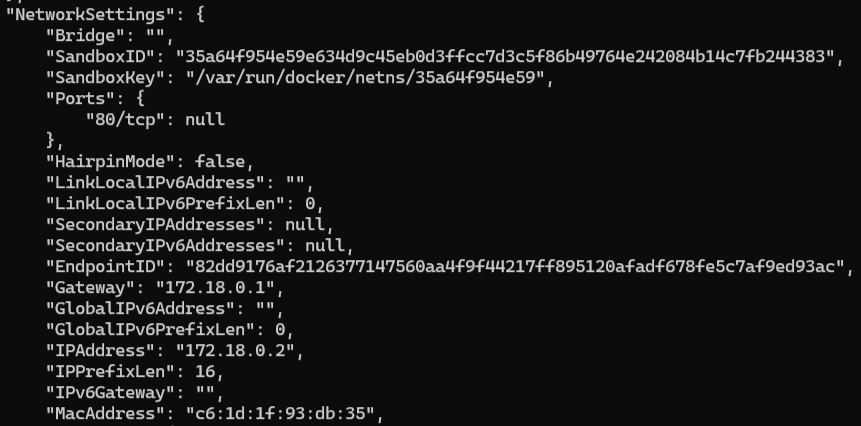

- Для остановки контейнера используется команда `docker stop [container_id]`.
- Чтобы проверить, действительно ли остановился контейнер, можно выполнить команду `docker ps`, а, используя флаг `-a`, можно посмотреть все контейнеры, как запущенные, так и нет.

    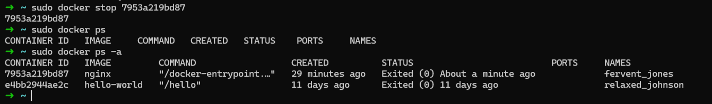

- Для запуска на выбранных портах необходимо выполнить следующую команду: `docker run -d -p 80:80 -p 443:443 --name nginx_ports nginx`. Она запускает контейнер в фоне (флаг `-d`) с портами 80 и 443, присваивая имя контейнеру `nginx_ports`.

    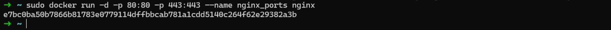

- Для проверки запуска nginx следует перейти по адресу `localhost:80`, чтобы увидеть стартовую страницу nginx.

    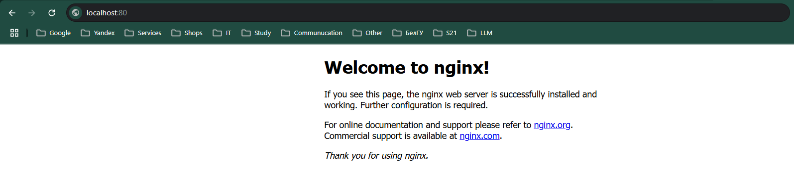

- Для перезапуска используется команда `docker restart` с указанием либо имени, либо уникального идентификатора контейнера. Посмотреть статус работы контейнера можно всё той же командой `docker ps`.

    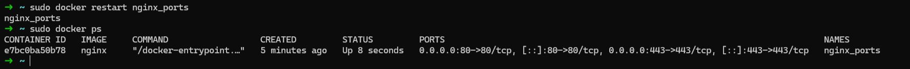

---

## Part 2. Операции с контейнером

- Прочитать текущий `nginx.conf` внутри контейнера:

    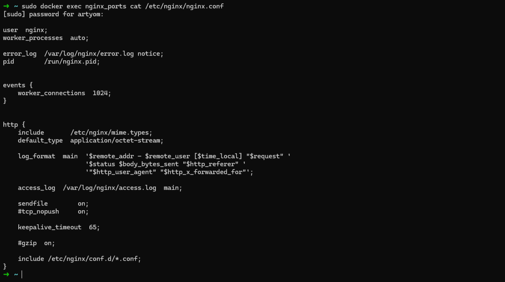

- Можно самостоятельно указать настройки конфигурации. Для этого будет создан на локальной машине файл `nginx.conf` и настроены в нем по пути `/status` отдача страницы статуса сервера nginx.

    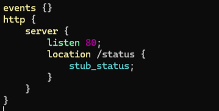

    - `events {}` - Блок для настройки параметров обработки событий. Параметры по умолчанию, если блок пустой.
    - `http { ... }` - Блок для настройки HTTP-сервера, включая виртуальные серверы, прокси и кэширование.
    - `server { ... }` - Определяет виртуальный сервер и настраивает параметры, такие как порт и обработка URL.
    - `listen 80;` - Указывает, что сервер будет слушать на порту 80 (стандартный порт для HTTP).
    - `location /status { ... }` - Определяет обработку запросов к пути `/status`, позволяя настроить специфическую обработку URL.
    - `stub_status;` - Включает модуль для получения информации о состоянии Nginx, отображая статистику активных соединений и запросов.

- После реализации конфигурации локально её необходимо скопировать в контейнер:

    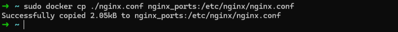

- После копирования необходимо произвести перезапуск nginx внутри докер-образа через команду exec.

    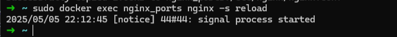

- После сделанных манипуляций можно проверить, что по адресу `localhost:80/status` отдается страничка со статусом сервера nginx.

    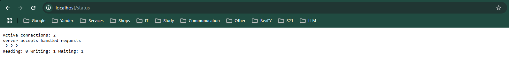

- Используя команду `docker export`, можно экспортировать текущий образ в архив.

    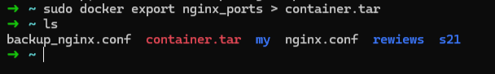

- Перед удалением установленного контейнера его необходимо остановить, используя команду `docker stop`, а затем удалить, используя команду `docker rm`.

    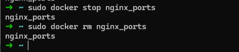

- Теперь можно в целом удалить образ `nginx`, используя команду `docker rmi nginx`.

    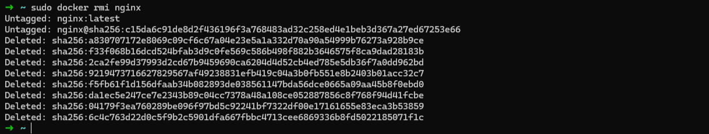

- Так как до этого была экспортирована копия контейнера, его можно обратно загрузить, используя команду импорта `docker import`.

    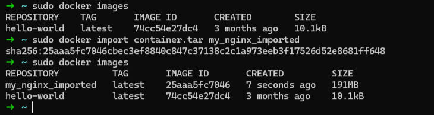

- Теперь можно обратно запустить контейнер. Отличие от прошлого запуска в том, что теперь появился флаг `-g "daemon off;"`, который обязателен при ручном запуске Nginx в Docker, чтобы контейнер оставался активным. Без него контейнер будет останавливаться сразу после старта.

    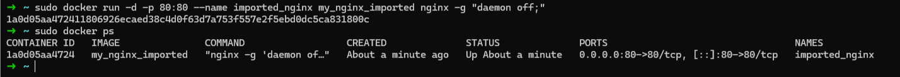

- Помимо проверки активности процесса можно запустить страницу в браузере и явно увидеть работу запущенного импортированного контейнера.

    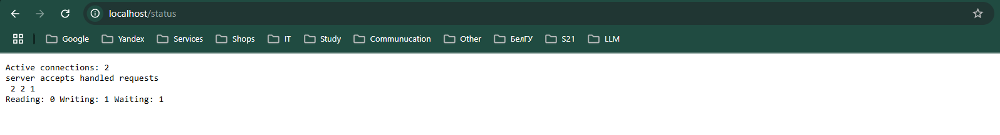

---

## Part 3. Мини веб-сервер

> Перед выполнением задания необходимо убедиться, чтоб установлены пакеты для создания сервера на си. Для этого следует выполнить команды:
```bash
sudo apt-get update
sudo apt-get install gcc spawn-fcgi libfcgi-dev
```

- Используя библиотеку FastCgi можно написать простой сервер, который будет возвращать страничку с надписью "Hello, World!".

    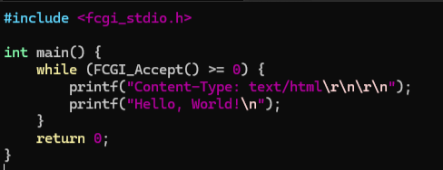

- Теперь необходимо скомпилировать написанное приложение мини-сервера.

    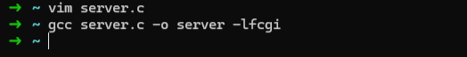

- После чего можно запустить написанный мини-сервер через spawn-fcgi на порту 8080.

    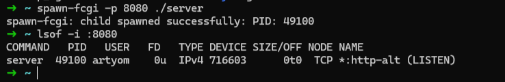

- Но пока что в браузере ничего не будет отображаться. Необходимо сконнектить сервер с nginx. Для этого также необходимо прописать файл конфигурации с указанием требуемых действий.

    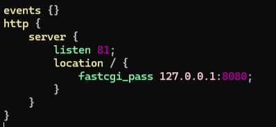

- Теперь необходимо запустить локально написанный сервер.

    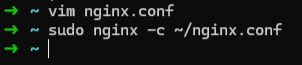

- И в конце можно проверить его работу.

    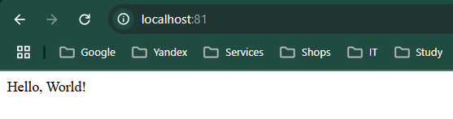

---

## Part 4. Свой докер

- Для выполнения данного задания необходимо учесть при написании своего Dockerfile следующие параметры:
    1) сборка исходников мини сервера на FastCgi из Части 3;
    2) запуск его на 8080 порту;
    3) копирование внутрь образа написанный ./nginx/nginx.conf;
    4) запуск nginx.
- В результате был получен следующий Dockerfile:

    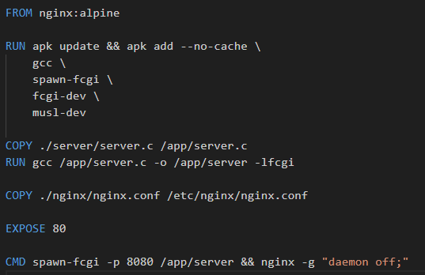

- После написания файла докера, его необходимо собрать командой `docker build`.

    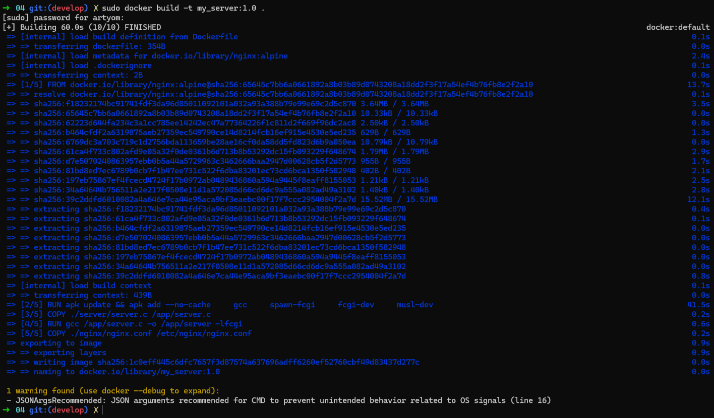

- Можно посмотреть наличие своего докера в общем списке установленных.

    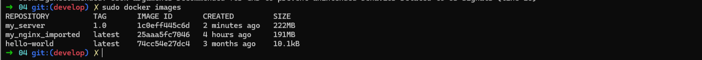

- Теперь можно запустить докер (однако заранее необходимо проверить и остановить запущенные раннее на этом порте контейнеры).

    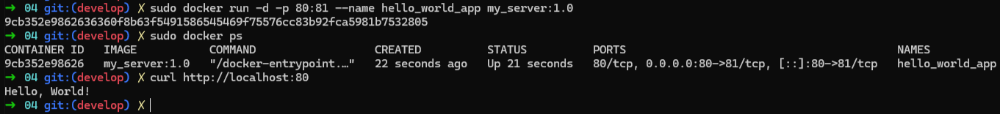

- Также можно открыть в браузере `localhost:80`.

    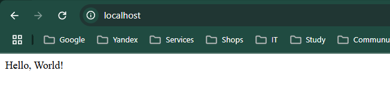

- Для дальнейшего выполнения задания необходимо внести изменения в существующий докер. Для этого будет изменен конфигурационный файл `./nginx/nginx.conf`, в него будет добавлен пункт просмотра статуса из прошлых частей выполнения задания.

    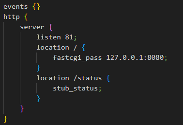

- Теперь необходимо заново пересобрать контейнер `docker build`.

    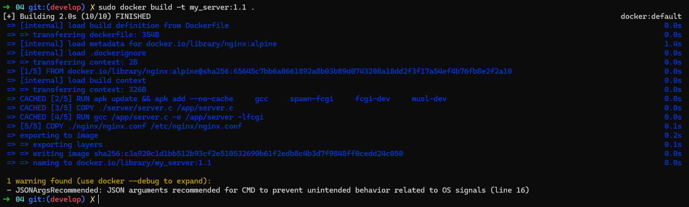

- Затем вновь можно запустить докер и просмотреть, что изменилось.

    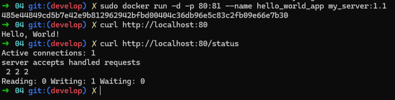

- Также в подтверждение можно зайти в браузер и открыть `localhost:80/status`.

    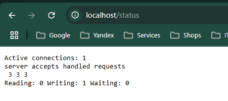

---

## Part 5. Dockle

- Для проверки корректности написания докера используется утилита Dockle. В моём сценарии не получилось корректно запустить её в подсистеме Windows, поэтому, используя архивирование и возможность просмотра архивного контейнера, была задействована программа.

    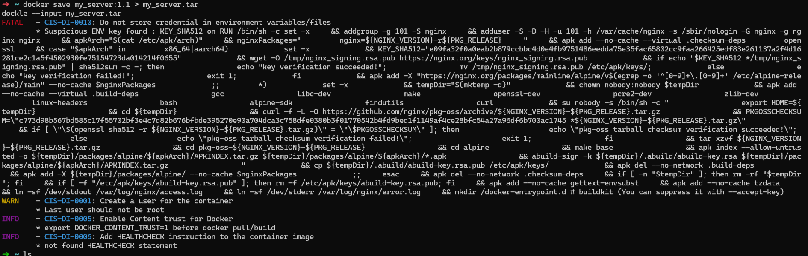
    При анализе образа были получены следующие сообщения:
    - **Ошибка FATAL - CIS-DI-0010 (подозрительная переменная KEY_SHA512).** - Эта ошибка возникает из-за того, что базовый образ nginx:alpine использует переменные окружения для проверки подписей пакетов. Dockle считает это нарушением безопасности.
    - **Предупреждение WARN - CIS-DI-0001 (запуск от root).** - Dockle рекомендует запускать контейнер от непривилегированного пользователя.
    - **Информационное сообщение INFO - CIS-DI-0005 (Content Trust).** - Это рекомендация, а не ошибка. Связана она с проверкой цифровых подписей.
    - **Информационное сообщение INFO - CIS-DI-0006 (отсутствие HEALTHCHECK).** - Необходимо добавить HEALTHCHECK в Dockerfile. Данная директива используется для определения состояния (здоровья) контейнера. 

- После применения исправлений, можно составить новый Dockerfile.

    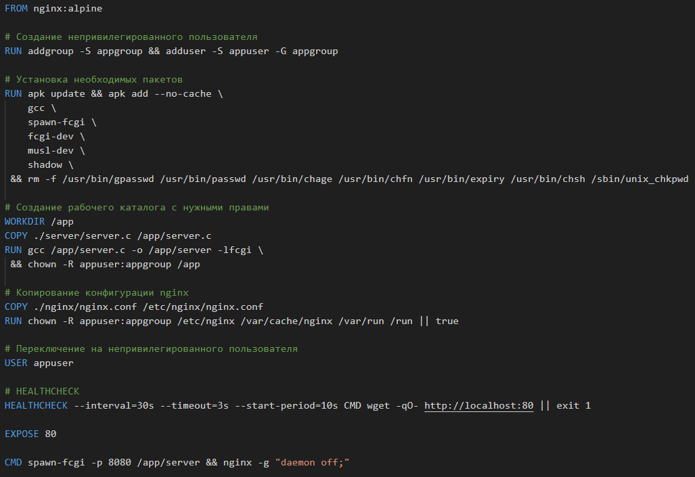

- Затем также пересоберем и просмотрим заново образ на безопасность.

    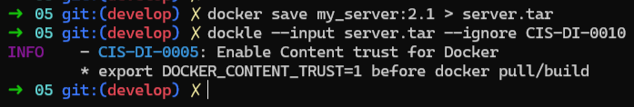

    *В рамках текущего задания эту рекомендацию можно проигнорировать.*

---

## Part 6. Базовый Docker Compose

- Для начала необходимо изменить Dockerfile из Части 5, чтобы он работал в локальной сети, т. е. не нужно использовать инструкцию EXPOSE и мапить порты на локальную машину.

    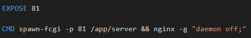

- Для того, чтобы поднять докер-контейнер с `nginx`, который будет проксировать все запросы с 8080 порта на 81 порт первого контейнера, необходимо внести изменения в файл `nginx.cong`.

    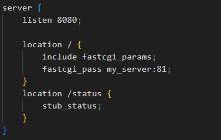

- После чего можно создать файл `docker-compose`, в котором будут указаны все необходимые по заданию опции.

    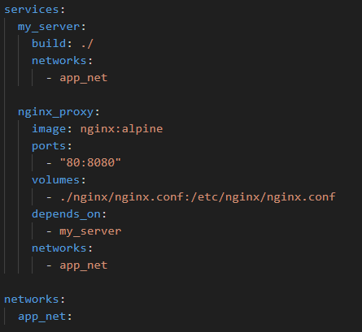

- Перед запуском необходимо остановить все запущенные процессы, быстро это можно сделать при помощи следующей команды:

    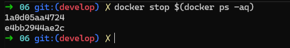

- Теперь можно начать тестирование. Сборка композированного файла осуществляется через следующую команду:

    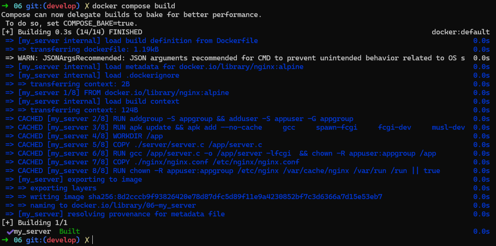

- Запуск осуществляется через следующую команду:

    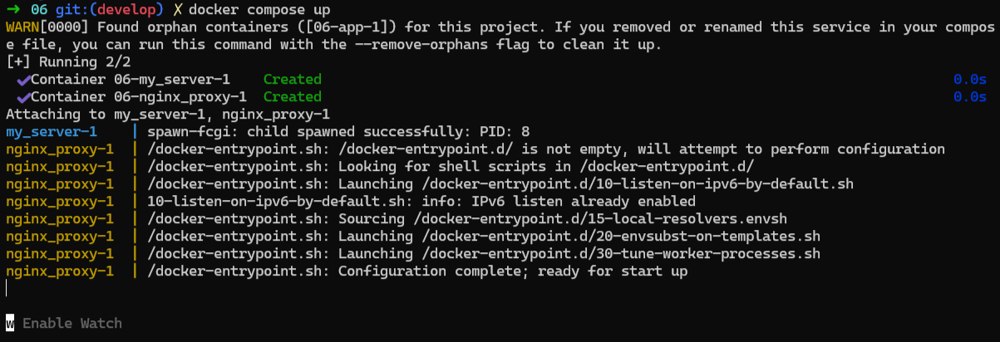

- В результате можно открыть браузер и проверить, что отображается написанная стартовая страница.

    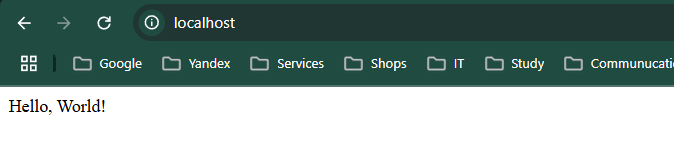