# Basic CI/CD
## Part 1. Настройка gitlab-runner

- Превым шагом является добавление официального репозитория Gitlab'а. Для этого выполняется следующая команда:
    ```bash
    curl -L "https://packages.gitlab.com/install/repositories/runner/gitlab-runner/script.deb.sh" | sudo bash
    ```

    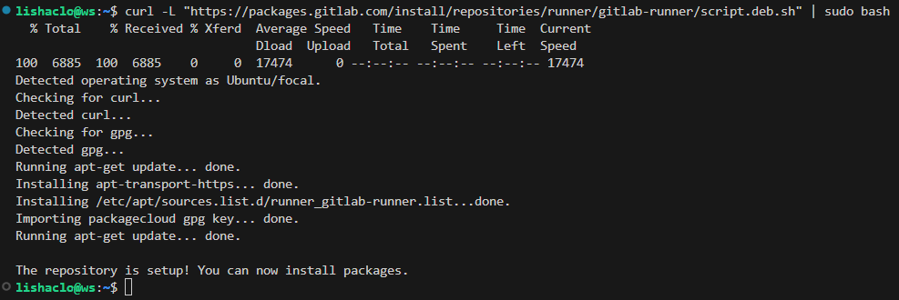

- Затем требуется скачать сам Gitlab runner. Для этого используется следующая команда:
    ```bash
    sudo apt install gitlab-runner
    ```

    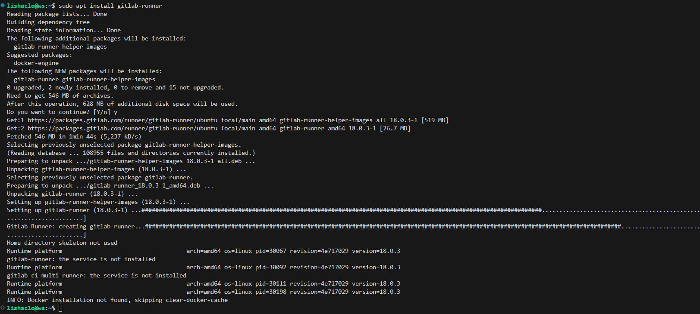

- Теперь необходимо найти токен активации. Он располагается на страничке проекта:

    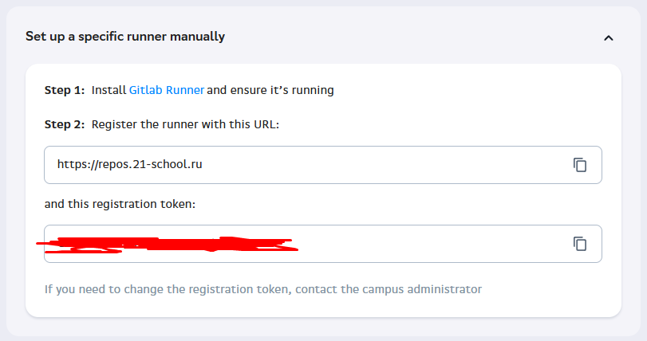

- После чего необходимо выполнить команду для регистрации Gitlab runner'а:
    ```bash
    sudo gitlab-runner register
    ```

- После чего ввести URL и токен, найденные ранее в проекте и выбрать исполнителя (например, `shell`).

    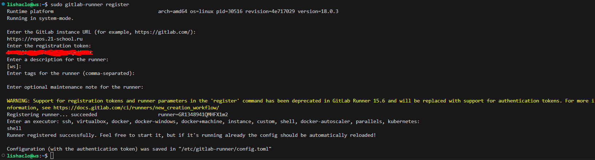

- На данном этапе можно проверить корректность запуска службы, используя команду:
    ```bash
    systemctl status gitlab-runner
    ```

    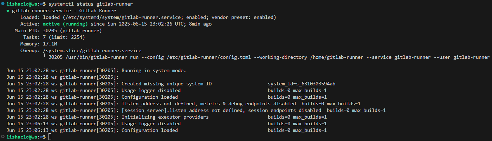

- На данном шаге выполнение первой части окончено, образ виртуальной машины сохранён локально.

## Part 2. Сборка

- Первым шагом будет добавление в текущий репозиторий старого проекта `SimpleBashUtils`.

- Затем следует создать в корне репозитория файл `.gitlab-ci.yml`, в котором будет указано следующее:
```yml
stages:
  - build

build_project:
  stage: build
  script:
    - cd src/SimpleBashUtils/cat && make
    - cd ../../../
    - cd src/SimpleBashUtils/grep && make
  artifacts:
    paths:
      - src/SimpleBashUtils/cat
      - src/SimpleBashUtils/grep
    expire_in: 30 days
```

- После чего необходимо сохранить изменения и отправить их в удаленный репозиторий.

- Теперь можно перейти в раздел `Build -> Jobs` и увидеть результат сборки проекта:

    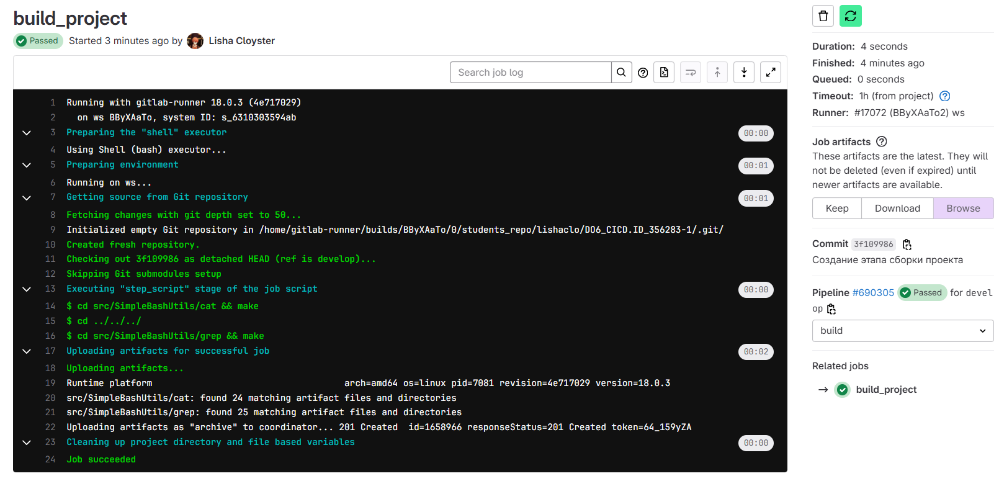

- Выполнение второй части окончено.

## Part 3. Тест кодстайла

- Необходимо изменить файл `.gitlab-ci.yml`, добавив в него новый этап:
```yml
stages:
  - build
  - style

# ...

codestyle:
  stage: style
  script:
    - clang-format -n --Werror -style=Google $(find src/SimpleBashUtils/ -type f -name *.c -o -name *.h)
```

- После чего сохранить и запушить изменения. В результате в разделе `Build -> Pipeline` появится информация о результате прохождения стадий:

    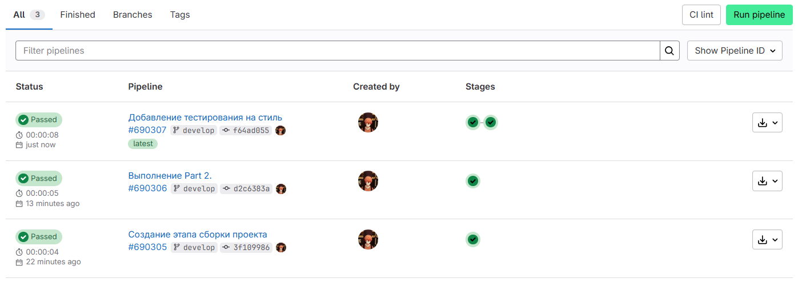

- Можно также открыть подробности (раздел `Build -> Jobs`) отдельно для этапа `codestyle`:
    
    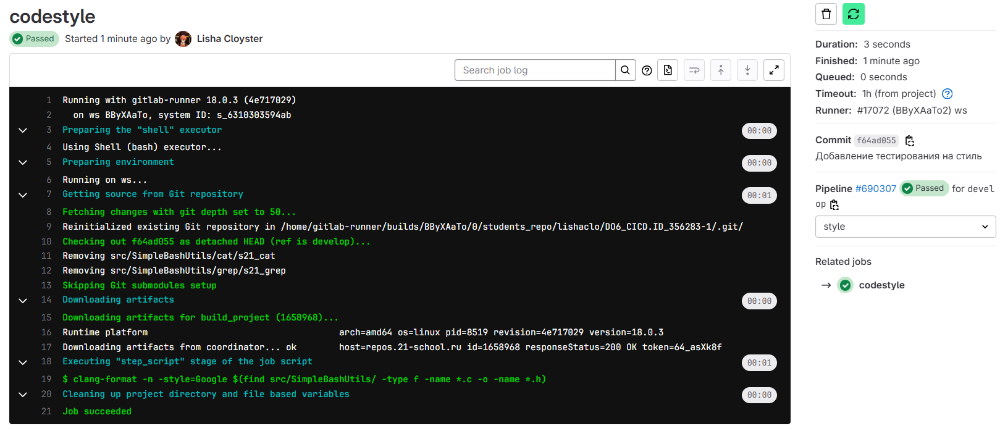

- В случае возникновения ошибки, это можно увидеть в разделе `Build -> Pipeline`:

    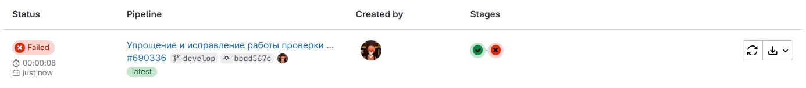

- Подробности данного этапа при возникновении ошибки:

    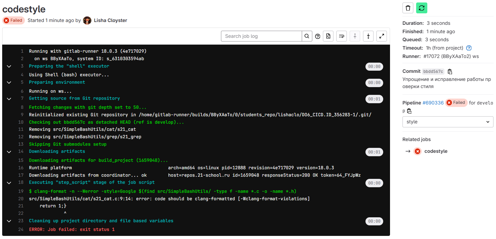

- Выполнение третьего этапа окончено.

## Part 4. Интеграционные тесты

- Для создания этапа с итерационными тестами, необходимо добавить соответствующий этап в `.gitlab-ci.yml` файл:
```yml
stages:
  - build
  - style
  - test

# ...

integration_tests:
  stage: test
  dependencies:
    - build_project
    - codestyle
  script:
    - cd src/SimpleBashUtils/cat/tests && bash s21_tester_cat.sh
    - cd ../../../../
    - cd src/SimpleBashUtils/grep/tests && bash s21_tester_grep.sh
  allow_failure: false
```

- Здесь указаны дополнительные параметры, такие как:
    - `dependencies` - гарантирует, что данный этап будет запущен только после успешного выполнения предыдущих;
    - `allow_failure: false` - останавливает pipeline при провале тестов.

- В результате запуска Pipeline'а можно протестировать его работоспособность в нескольких случаях:
  - В первый раз при успешном тестировании;
  - Во второй раз добавлена ошибка в код, которая будет фейлить процесс итерационного тестирования;
  - В третий раз - добавлена стилевая ошибка, которая остановит выполнение Pipeline'а.
  
- Этот процесс тестирования отображен на рисунке:

    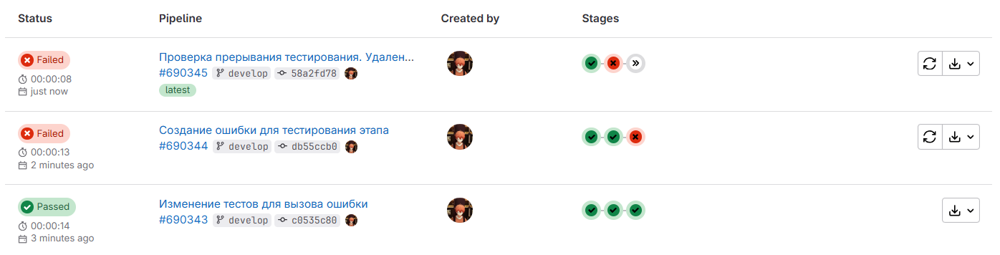

- Выполнение четвёртого этапа окончено.

## Part 5. Этап деплоя

- Для начала необходимо создать и настроить вторую виртуальную машину. Необходимо на неё установить OpenSSH-server (`sudo apt install openssh-server`).

- Затем следует изменить параметры сети, чтобы не возникало проблем при подключении. Для этого в настройках виртуальной машины было выбрано подключение к сети через сетевой мост и по аналогии с прошлыми проектами **DO** была настроена конфигурация сети, чтобы можно было подключиться к данной виртуальной машине по SSH для передачи ключа.

  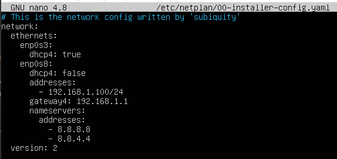

- Для большего контроля на второй ВМ был создан пользователь `deploy_user`, которому были выданы права суперпользователя, а также права для перемещения файлов в директорию `/usr/local/bin` без пароля, используя команду `sudo chmod 777 /usr/local/bin`.

  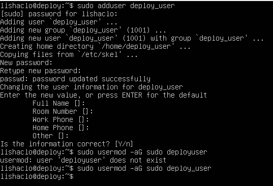

- На первой виртуальной машине необходимо сгенерировать ssh-ключ, чтобы в дальнейшем его передать на другую машину. Для генерации используется команда `ssh-keygen` от имени Gitlab runner'а.

  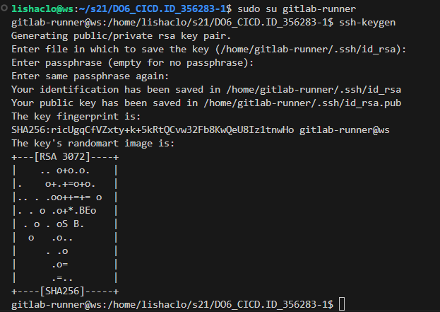

- Затем необходимо произвести отправку ключа на вторую машину, используя команду `ssh-copy-id` с адресом второй машины.

  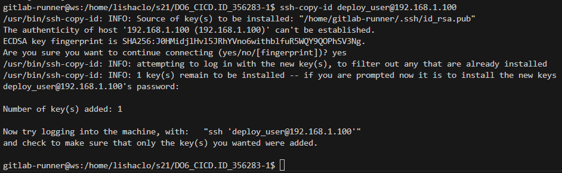

- После чего можно написать bash-скрипт, который скопирует собранные артефакты с одной машины на другую:
```bash
#!/bin/bash

VM_IP="192.168.1.100"
USER="deploy_user"

scp src/SimpleBashUtils/cat/s21_cat src/SimpleBashUtils/grep/s21_grep $USER@$VM_IP:/usr/local/bin
```

- А также необходимо добавить новый этап, который будет запускаться вручную и только тогда, когда все предыдущие были пройдены успешно:
```yml
stages:
  - build
  - style
  - test
  - deploy

# ...

deploy:
  stage: deploy
  when: manual
  dependencies:
    - build_project
    - codestyle
    - integration_tests
  script:
    - bash src/deploy.sh
```

- В результате получилось пройти все этапы в Pipeline'е. Последний этап необходимо запускать вручную, а при запуске происходит деплой.

  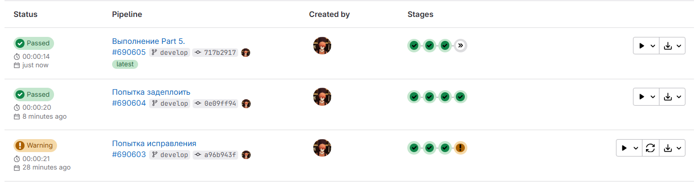

- В результате можно открыть необходимую директорию на второй машине и убедиться, что файлы были действительно скопированы.

  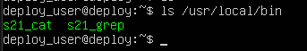

- Выполнение пятой части окончено.

## Part 6. Дополнительно. Уведомления

- Для создания бота в Telegram необходимо получить уникальный токен, используя официального бота **@BotFather**.

- После чего необходимо получить id чата, в который будет происходить отправка сообщений. Для этого следует выполнить запрос `curl https://api.telegram.org/bot<TOKEN>/getUpdates` и вытащить `chat_id`.

- Чтобы написать бота, можно использовать всё те же запросы, которые можно оформить через bash-скрипт. Во время написания скрипта, можно использовать переменные окружения, где хранится важная информация. Например, `$CI_JOB_STATUS` хранит в себе статус выполнения этапа. В результате структура скрипта будет следующая:
```bash
#!/bin/bash

TELEGRAM_BOT_TOKEN="<TOKEN>"
TELEGRAM_CHAT_ID="<ID>"

if [ "$CI_JOB_STATUS" == "success" ]; then
    MESSAGE="✅ Pipeline succeeded!"
else
    MESSAGE="❌ Pipeline failed!"
fi

curl -s -X POST "https://api.telegram.org/bot$TELEGRAM_BOT_TOKEN/sendMessage"  \
    -d chat_id="$TELEGRAM_CHAT_ID" \
    -d text="$MESSAGE"
```

- В конфигурационном файле `.gitlab-ci.yml` необходимо добавить точку запуска скрипта. Пусть будет выполнение на каждом этапе после основной операции:
```yml
# ...
  after_script:
    - bash src/TelegramBot.sh
```

- По итогу был составлен бот, который присылает сообщение на каждом из этапов, где показывает информацию в том числе об успехе или неудаче.

  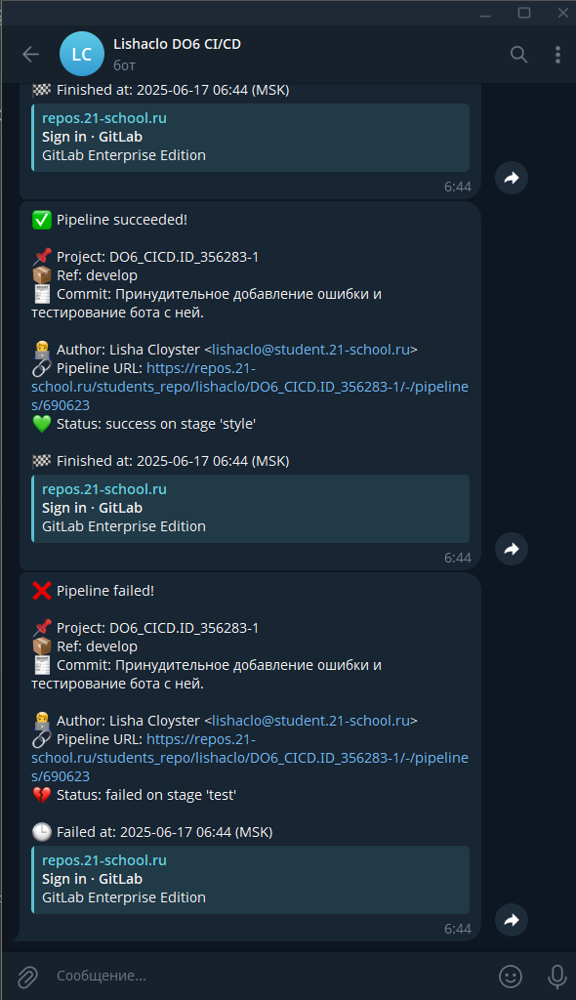

- Выполнение шестой бонусной части окончено. Работа выполнена. Образ виртуальной машины сохранён локально.